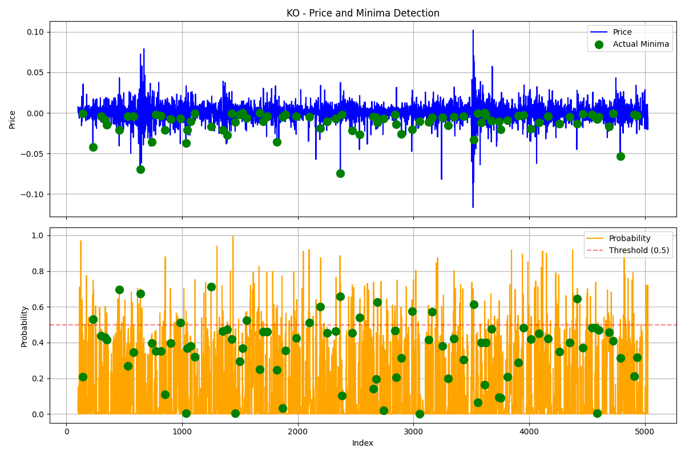

# Market Bottom Predictor

A neural network that predicts market minima (local bottoms) from price data.

## Overview

Trains a single-hidden-layer neural network on windows of price returns to predict when a market bottom will occur.

## Project Structure

- `src/main.rs` - Neural network implementation (training, evaluation, prediction)
- `training_data.csv` - Training data
- `evaluation_data.csv` - Evaluation data
- `predictions.csv` - Output predictions
- `plot.py` - Static plotting script
- `interactive_plot.py` - Interactive visualization with ticker selection

## Requirements

- Rust (latest stable)
- Python 3 with matplotlib and pandas

## Build & Run

```bash
cargo run
```

## Usage

```bash
# Static plots for all tickers
python3 plot.py

# Interactive plot
python3 interactive_plot.py
```

## Model Details

- **Architecture**: Single hidden layer (50 neurons)
- **Input**: Window of 100 price returns (percentage change from previous price)
- **Hidden activation**: Leaky ReLU (slope 0.01 for negative values)
- **Output activation**: Sigmoid
- **Loss**: Weighted binary cross-entropy (positive class weighted 15x)
- **Optimization**: Stochastic gradient descent, learning rate 0.01, 5 epochs
- **Threshold**: 0.70 for positive prediction
- **Weight initialization**: He init for hidden weights, Xavier init for output weights

## Example Output



The top panel shows price returns with actual minima marked in green. The bottom panel shows the model's probability predictions with a 0.7 threshold line.

## Data Format

CSV files with columns: `ticker`, `index`, `price`, `is_minima`

- `ticker`: Stock/asset symbol
- `index`: Time index
- `price`: Price value
- `is_minima`: 1 if bottom, 0 otherwise

During preprocessing, prices are converted to percentage returns within each ticker and the first row per ticker is removed.